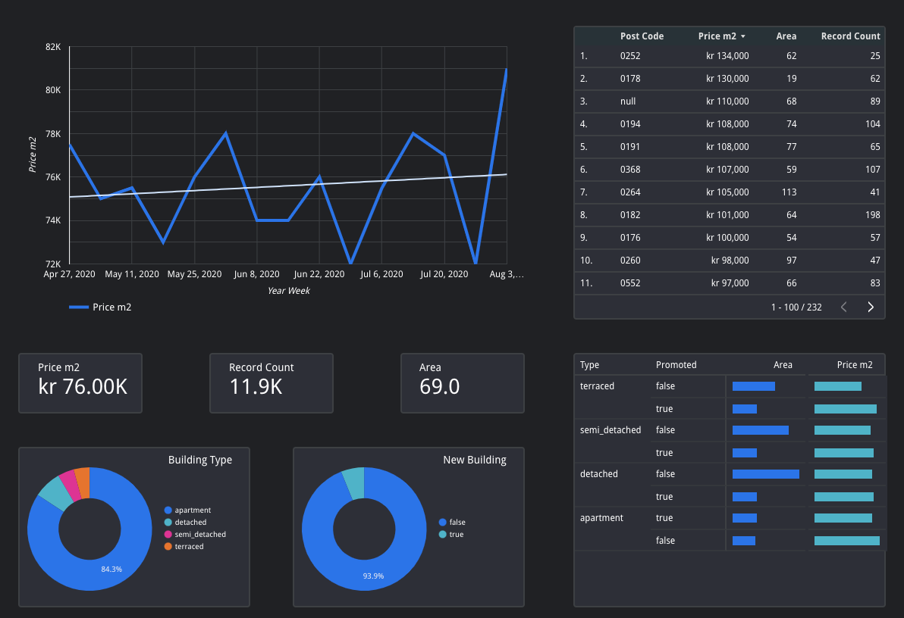
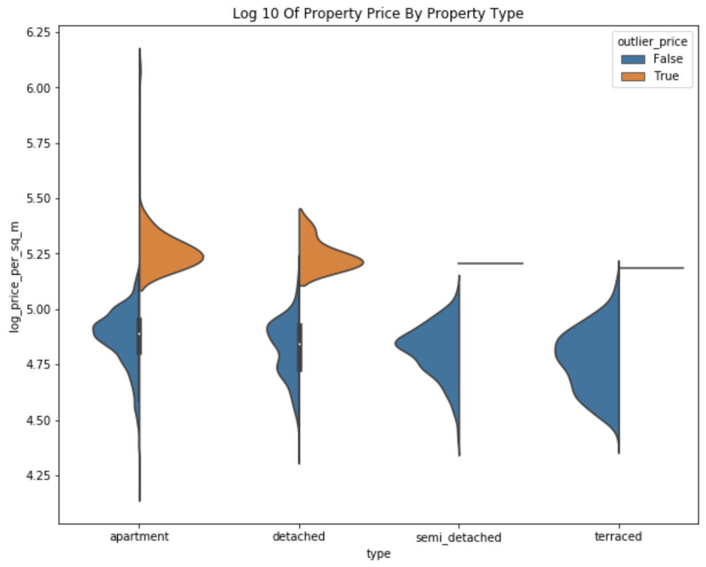
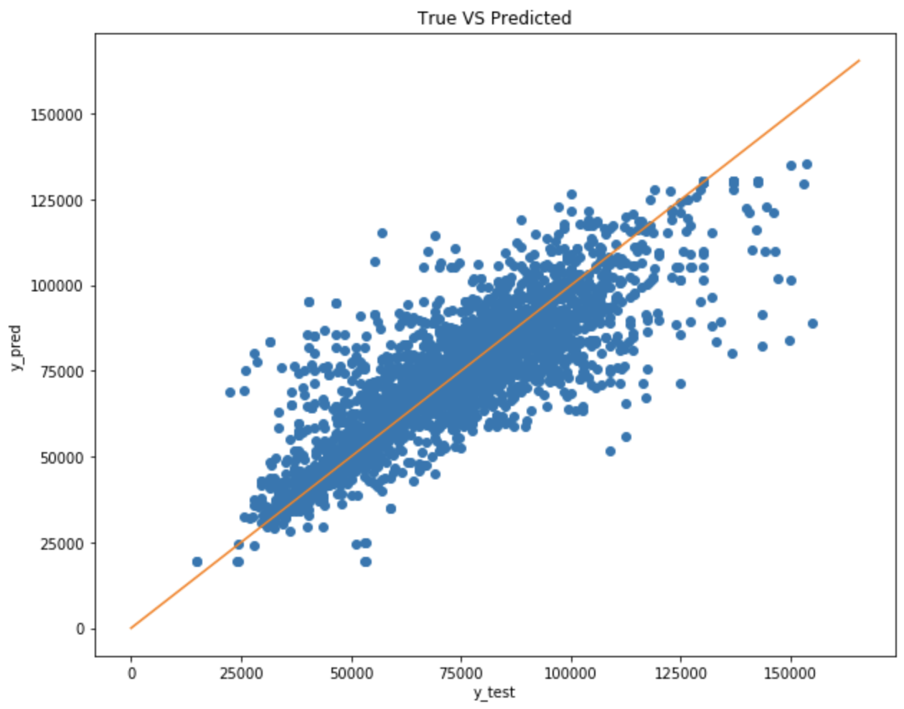

# Model House Price
In this project, we use a dataset collected by the *Curious Bot Homes* crawler and model the asking price of a real estate. The purpose of this exercise is to be able to estimate when a property is undervalued i.e. its predicted asking price is lower (by a certain margin) than the actual asking price.

## Problem Definition
A prudent purchase of real estate requires a good knowledge of the market. Subject matter experts (in this case real estate agents) usually develop an intuitive knowledge of the market. That is, they build up experience over several years in order to be able to evaluate a property.

Unfortunately, we cannot invest the same amount of time, but we need to achieve a comparable result in order to make a prudent purchase. Therefore, we will attempt to model the market. Thus, our problem is:

> To develop a model that has less than 50 000 USD error on the asking price of a 65 $m^2$ apartment.

## Exploratory Visualization And Analysis
### Dashboard
We set up a dashboard in Google Data Studio with some of the data we collect in *Curious Bot Homes*. This allows us to:

* Develop an intuition about the problem. This answers questions such as:
    * What is the ratio of the various property types in general?
    * How big is a median property in the area of interest?
    * What kind of properties get promoted?
* Develop an understanding about the real estate market. This answers questions such as:
    * How does the price trend develop over time?
    * How many ads per day / week / month appear in the target area?

### Geographical Visualization
Understanding the property market also includes developing an intuition about the price in various parts of the target area. In the long run, this also allows us to understand our model's predictions and to be discerning about the validity of said predictions.

To achieve that, we set up a Kepler GL visualization with the following layers:

* The median price per hexagon
* The mode of the real estate type per hexagon
* The median real estate area per hexagon

### Exploratory Data Analysis
To gain insights into the raw data and develop robust statistical models, we performed a quick [exploratory data analysis](eda.ipynb). In it, we explore mainly the area and price distributions for normal values as well as outliers (i.e. price having `z-score >= 3`).

## Benchmark
Our selected benchmarks are:
* The median price of all properties in the train dataset
* The median price per post code for all post codes in the train dataset

| Model Name                             | explained_variance | mean abs error | mean percentage error | r2 score |
|----------------------------------------|--------------------|----------------|-----------------------|----------|
| [Benchmark] Median Price               | 0%                 | 16586          | 27%                   | -0%      |
| [Benchmark] Median Price Per Post Code | 27%                | 13584          | 22%                   | 26%      |

## Algorithms And Techniques
We will experiment with the following algorithms:
* Linear Models:
    * Linear Regression
    * Gradient Boosting Regression
* Deep Learning:
    * Deep Neural Network
    * Wide And Deep Model

## Data Preprocessing
The following transformations and feature engineering techniques are performed on the dataset:
* The `area` is bucketized into bins of 30 $m^2$
* The `type` is one-hot encoded
* The `post_code` is one-hot encoded
* Crossed columns:
    * `real_estate_type` x `area_bucketized`
    * `post_code_1_hot` x `area_bucketized`
    * `post_code_1_hot` x `real_estate_type`

## Implementation
The benchmarking, feature engineering and modelling are performed in the [model_prototypes.ipynb](model_prototypes.ipynb) notebook. The results, based on a sample of 1.1e4 records, are:

| Model Name                             | explained_variance | mean abs error | mean percentage error | r2 score |
|----------------------------------------|--------------------|----------------|-----------------------|----------|
| [Benchmark] Median Price               | 0%                 | 16586          | 27%                   | -0%      |
| [Benchmark] Median Price Per Post Code | 27%                | 13584          | 22%                   | 26%      |
| Linear Model                           | 60%                | 9983           | 14%                   | 60%      |
| Deep Neural Network                    | 63%                | 9076           | 13%                   | 63%      |
| Wide And Deep Model                    | 69%                | 7980           | 11%                   | 69%      |

Our best model has an error of 51 870 USD for a 65 $m^2$ apartment.

## Justification
Even though our initial experiment did not meet the mark as specified in the **Problem Definition**, there are a few positive points worth mentioning:
* The model's error is reasonably close to the benchmark. Therefore, the model can be used in production as an initial version.
* All data transformations and all engineered features are specified in the feature layer of the model. This gives us the benefits that:
    * The code is portable
    * We only ned raw data (the transformations are performed inside the model itself).
* The residuals are reasonable and in line with expectations:

## Reflection
We built a web app in order to automate the process of data collection. We stored the data in BigQuery and created several procedures for data cleaning. We built a dashboard to help us gain an intuition about the real estate market as well as to sense check our model results. We performed an exploratory data analysis and identified the major trends in the data. We performed feature engineering and trained 4 models. We evaluated them against the benchmark and our problem definition.

Finally, we selected a model that is:
* Close to the specifications of this task
* Easy to implement
* Takes raw data

## Improvement
We still have not fully utilized the text description of the properties. In the next iteration of this exercise, we plan on utilizing natural language processing over this feature. This will allow us to concatenating the resulting model with the existing wide and deep model.